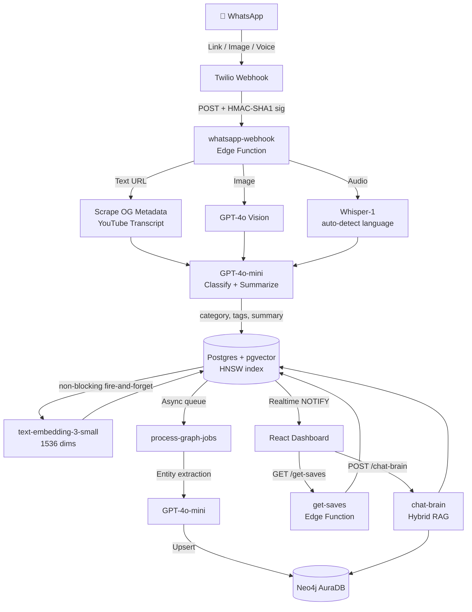
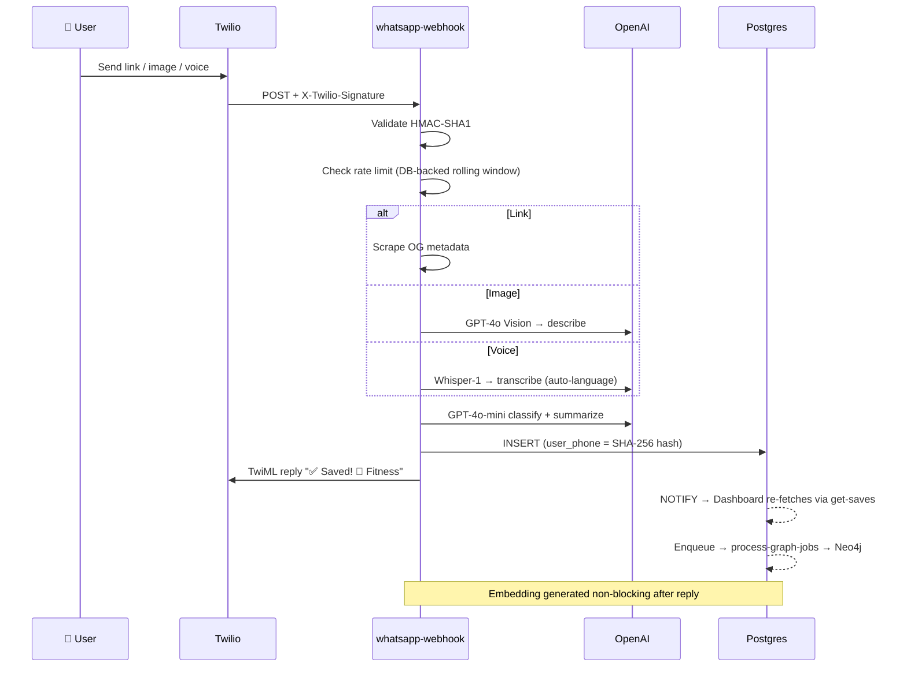

<div align="center">

# 🔖 Social Saver

### **Turn any WhatsApp message into an AI-powered, searchable knowledge graph.**

[](https://vitejs.dev/)
[](https://supabase.com/)
[](https://openai.com/)
[](https://neo4j.com/)
[](https://github.com/pgvector/pgvector)
[](https://twilio.com/)
[](https://playwright.dev/)

*Send a link → AI classifies it → Graph stores it → You search, recap, and rediscover it.*

**[Open Live Demo →](https://social-saver.vercel.app)**

</div>

---

## Table of Contents

- [Overview](#-overview)
- [Feature Status](#-feature-status)
- [Architecture](#️-architecture)
- [AI Pipeline](#-ai-pipeline)
- [Security Model](#-security-model)
- [Tech Stack](#️-tech-stack)
- [Quick Start](#-quick-start)
- [Demo Script](#-demo-script-60-seconds)

---

## 🎯 Overview

Social Saver is a **WhatsApp-first personal knowledge graph**. You text a link, image, or voice note to a Twilio bot. Within seconds, GPT-4o-mini classifies it, generates a summary, creates HNSW-indexed vector embeddings, and extracts semantic entities — then surfaces everything through a hybrid Graph-RAG engine that connects concepts across your entire library.

**Zero-friction input.** No app to open. No extension to install. No folders, tags, or names.  
**Compounding intelligence.** Every save enriches the graph, making every future retrieval more precise.

> Demo mode loads automatically with 9 mock saves when no credentials are configured — try it now at **[social-saver.vercel.app](https://social-saver.vercel.app)**.

---

## ✨ Feature Status

### 🟢 Shipped & Stable

| Feature | Tech | Notes |
|---|---|---|
| 📱 **WhatsApp Inbox** | Twilio | Link, image, or voice note → AI reply in ~3s |
| 🏷️ **AI Classification** | GPT-4o-mini | Auto category + 3–6 tags + 20-word summary, zero user input |
| 🎙️ **Voice Note Transcription** | Whisper-1 | Multilingual auto-detect — no hardcoded language |
| 📸 **Image Understanding** | GPT-4o-mini Vision | Describes images, classifies content |
| 🔒 **Server-Mediated DB Access** | Supabase RLS + Edge Fns | Anon key blocked. All reads/writes through service-role-only edge functions |
| 🛡️ **SHA-256 Phone Hashing** | Deno `crypto.subtle` | Raw phone numbers never touch the DB |
| 🔐 **Twilio Signature Validation** | HMAC-SHA1 | Every webhook validated — rejected on mismatch |
| ⏱️ **Timing-Safe Auth** | XOR byte comparison | `DEMO_KEY` comparison uses constant-time logic — timing-attack resistant compare |
| 🚫 **Fail-Closed Auth** | env check | Missing `DEMO_KEY` → 403. Never silently open access |
| ⚡ **HNSW Vector Index** | pgvector | O(log n) similarity search — no more full table scans |
| ⏳ **Persistent Rate Limiting** | Supabase Postgres | Per-phone quotas with rolling windows; survive Deno cold starts |
| 📡 **Realtime UX** | Supabase WebSockets | Realtime triggers cache invalidation; UI re-fetches via `get-saves` (server-mediated) |
| 📅 **Weekly AI Recap** | GPT-4o-mini | Weekly digest: themes, patterns, "try next" suggestions |
| 📝 **Notion Export** | Notion API | Batch export of all saves with rate-limit handling |
| 🔁 **Dead-Letter Queue** | Postgres | Failed Neo4j jobs retry 3× then land in `failed_graph_jobs` |
| 🧪 **E2E Tests** | Playwright | Dashboard load + Graph-RAG chat flow — fully mocked |

### 🟡 Experimental (Working, Evolving)

| Feature | Tech | Notes |
|---|---|---|
| 🧠 **Hybrid Graph-RAG Chat** | Neo4j + pgvector | Vector + multi-hop graph traversal in parallel; 50-entry LRU cache with ⚡ badge |
| 🕸️ **Knowledge Graph UI** | Neo4j AuraDB | Force-directed entity map; graceful fallback to local category graph |
| 🔮 **Predictive Analysis** | GPT-4o-mini | Save a flight → hotel/packing suggestions auto-fire non-blocking in background |
| 🕵️ **Deep Research Mode** | GPT-4o-mini | One-click dossier: academic context, counter-arguments, "internet's take" |
| 🎲 **Random Inspiration** | get-saves edge fn | Offset-based random pick — rediscover forgotten saves |

### 🔴 Roadmap

| Feature | Notes |
|---|---|
| 🔐 **OTP Auth + per-user RLS** | Upgrade from phone-hash isolation to native `auth.uid()` policies |
| 📱 **Multi-channel gateway** | Telegram / Signal / iMessage beyond WhatsApp |
| 🌐 **Browser extension** | Save without picking up your phone |

---

## 🏗️ Architecture



### Webhook Sequence



---

## 🧠 AI Pipeline

### Hybrid Graph-RAG (`chat-brain`)

Every `Ask My Saves` query runs this pipeline in parallel:

```
1. Entity + intent extraction  →  GPT-4o-mini
   e.g. "basketball drills" → { intent: search, entities: ["basketball", "drills"] }

2. Vector similarity search    →  text-embedding-3-small + pgvector HNSW (cosine ≥ 0.45)

3. Graph traversal             →  Neo4j multi-hop CO_OCCURS_WITH walk (up to 2 hops)

4. Merge + rank                →  "both" > "graph" > "vector"; graph-only gets ×0.7 weight

5. Synthesize answer           →  GPT-4o-mini with top-10 saves as context

6. LRU cache                   →  50-item, 5-min TTL — ⚡ badge on cache hit
```

**Telemetry** returned per query: entities extracted, graph nodes matched, hop count (1 or 2), retrieval source per citation.

### Knowledge Graph Schema (Neo4j)

```cypher
(:User)-[:SAVED]->(:Save)-[:IN_CATEGORY]->(:Category)
(:Save)-[:HAS_TAG]->(:Tag)
(:Save)-[:MENTIONS]->(:Entity)          // GPT extracts tools, concepts, people
(:Entity)-[:CO_OCCURS_WITH]->(:Entity)  // weighted by co-save frequency
(:Entity)-[:RELATED_TO {rel}]->(:Entity)
```

Entity types: `tool · concept · topic · exercise · food · brand · person · other`

---

## 🚨 Security Model

| Layer | Implementation | Status |
|---|---|---|
| **Phone PII** | SHA-256 hash before every DB write; raw number never stored | ✅ |
| **Twilio Webhook Auth** | HMAC-SHA1 `X-Twilio-Signature` on every inbound request | ✅ |
| **DB Access Control** | RLS: `service_role` only. Anon key blocked for all 4 operations | ✅ |
| **Server-Mediated Reads** | All UI reads go through `get-saves` edge fn (service role); direct anon-key queries impossible | ✅ |
| **Tenant Isolation** | `update-save` / `delete-save` verify `user_phone` hash ownership before mutating | ✅ |
| **Timing-Safe Key Compare** | `DEMO_KEY` comparison uses XOR byte loop — timing-attack resistant compare | ✅ |
| **Fail-Closed Auth** | Missing `DEMO_KEY` → 403. Must set `DEMO_MODE=true` explicitly to open | ✅ |
| **Twilio Error Scrubbing** | Twilio errors logged server-side only; client receives generic 502 | ✅ |
| **Env Var Guards** | Missing `SUPABASE_URL` / `SUPABASE_SERVICE_ROLE_KEY` → explicit startup Error | ✅ |
| **URL Dedup Hashing** | `url_hash` uses `encode(sha256(url::bytea), 'hex')` — no MD5 collisions | ✅ |
| **Rate Limiting** | Postgres `rate_limits` — rolling windows, errors checked, resetAt from actual window_start | ✅ |
| **Dead-Letter Resiliency** | `failed_graph_jobs` table — failed Neo4j jobs preserved, not dropped | ✅ |
| **OTP Auth + User RLS** | Supabase `auth.uid()` policies. *Current demo uses a capability link (`?u=<hash>`) for simplicity; production replaces this with true OTP auth.* | 🔴 Roadmap |

> [!CAUTION]
> **Never use `TWILIO_SKIP_VALIDATION=true` in production.** It disables webhook signature verification, allowing anyone to POST fake WhatsApp messages to your endpoint. Local dev only.

---

## 🛠️ Tech Stack

### Backend — Supabase Edge Functions (Deno runtime)

| Component | Technology |
|---|---|
| LLM — classify, chat, research | OpenAI **GPT-4o-mini** |
| Vector embeddings | OpenAI **text-embedding-3-small** (1536 dims) |
| Vector search | **pgvector** HNSW index — cosine similarity |
| Vision (images) | OpenAI **GPT-4o Vision** |
| Audio transcription | OpenAI **Whisper-1** (auto language detection) |
| Knowledge graph | **Neo4j AuraDB** + Cypher |
| Messaging | **Twilio** WhatsApp Sandbox API |
| Auth guard | Timing-safe XOR + fail-closed `DEMO_KEY` |

### Frontend

| Component | Technology |
|---|---|
| Framework | React 18 + Vite |
| Styling | Tailwind CSS v4 |
| Realtime (cache invalidation) | Supabase JS WebSocket subscriptions |
| Accessibility | Full ARIA dialog roles, `aria-pressed`, `aria-expanded`, Escape key on all modals |
| Automated tests | **Playwright** E2E (2/2 passing; fully mocked — no credentials needed) |

---

## 🚀 Quick Start

### Prerequisites

- Node.js 18+
- [Supabase](https://supabase.com/) project
- [Twilio](https://twilio.com/) account (WhatsApp Sandbox)
- OpenAI API key — [platform.openai.com](https://platform.openai.com/api-keys)
- *(Optional)* [Neo4j AuraDB](https://neo4j.com/cloud/platform/aura-graph-database/) free instance

### 1. Clone & Install

```bash
git clone https://github.com/Aji-25/hack180dc.git
cd hack180dc/social-saver
npm install
```

### 2. Frontend Environment

```bash
cp .env.example .env
```

Fill in your values:

```env
VITE_SUPABASE_URL=https://YOUR_PROJECT_REF.supabase.co
VITE_SUPABASE_ANON_KEY=eyJ...
VITE_EDGE_FUNCTION_URL=https://YOUR_PROJECT_REF.supabase.co/functions/v1

# Demo mode — Twilio sandbox phone (used when no ?u= param in URL)
VITE_DEMO_PHONE=whatsapp:+14155238886

# Optional — enables live Knowledge Graph view
VITE_NEO4J_URI=neo4j+s://xxxx.databases.neo4j.io
VITE_NEO4J_USER=neo4j
VITE_NEO4J_PASSWORD=...
```

### 3. Link Supabase & Push Migrations

```bash
npx supabase link --project-ref YOUR_PROJECT_REF
npx supabase db push --include-all
```

This applies all migrations including:
- `pgvector` HNSW index on `saves.embedding`
- SHA-256 `url_hash` (replaces MD5)
- `graph_jobs.updated_at` auto-trigger
- `match_saves` function with CTE + `SET search_path`

### 4. Set Supabase Secrets

```bash
npx supabase secrets set OPENAI_API_KEY=sk-proj-...
npx supabase secrets set SUPABASE_URL=https://YOUR_PROJECT_REF.supabase.co
npx supabase secrets set SUPABASE_SERVICE_ROLE_KEY=eyJ...
npx supabase secrets set TWILIO_ACCOUNT_SID=AC...
npx supabase secrets set TWILIO_AUTH_TOKEN=...
npx supabase secrets set APP_URL=https://your-app.vercel.app
npx supabase secrets set DEMO_KEY=your-32-char-random-secret

# Optional — Knowledge Graph
npx supabase secrets set NEO4J_URI=neo4j+s://...
npx supabase secrets set NEO4J_USER=neo4j
npx supabase secrets set NEO4J_PASSWORD=...
npx supabase secrets set NEO4J_DATABASE=your-instance-id
```

> [!CAUTION]
> **Local Development Only.** This disables Twilio signature verification. **Never set in production.**
> ```bash
> npx supabase secrets set TWILIO_SKIP_VALIDATION=true
> ```

### 5. Deploy Edge Functions

For security, keep Supabase JWT verification ON by default for internal functions, but turn it OFF for the public webhook (which Twilio authenticates via HMAC):

```bash
# Public webhook (Twilio) — no JWT
npx supabase functions deploy whatsapp-webhook --no-verify-jwt

# Everything else — keep JWT verification ON (default)
npx supabase functions deploy get-saves update-save delete-save chat-brain deep-research graph-query notion-export process-graph-jobs graph-upsert-save random-save predictive-analysis regenerate-embeddings retry-classify send-reminders weekly-recap
```

### 6. Configure Twilio Webhook

In the [Twilio Console](https://console.twilio.com/) → Messaging → WhatsApp Sandbox → **"A Message Comes In"**:

```
https://YOUR_PROJECT_REF.supabase.co/functions/v1/whatsapp-webhook
```

### 7. Run Locally & Test

```bash
npm run dev

# E2E tests — no credentials required, fully mocked
npx playwright test tests/e2e.spec.ts --headed
```

---

## 🎬 Demo Script (60 seconds)

| Time | Action | What to Say |
|---|---|---|
| 0–7s | Point at the dashboard | *"Most bookmark apps require tagging, folders, naming. Social Saver requires nothing — just WhatsApp."* |
| 7–20s | Send a YouTube link to the bot | *"I texted a link. The edge function scrapes it, GPT-4o-mini classifies it — appears here in real time."* |
| 20–30s | Point at the card | *"Category, tags, 20-word summary — zero input from me."* |
| 30–42s | Type in Ask My Saves | *"This is Hybrid Graph-RAG. Vector similarity plus multi-hop Neo4j traversal — finds connections you'd never tag manually."* |
| 42–50s | Switch to Graph View | *"If we switch out of the grid, we can visualize the underlying topic extraction dynamically."* |
| 50–60s | Click Deep Research | *"One click generates a full research dossier — academic context, counter-arguments, and internet consensus. A true second brain."* |

---

<div align="center">

**🔖 Save smarter. Rediscover faster. Never lose a link again.**

Built with ❤️ for **Hack180**

</div>
