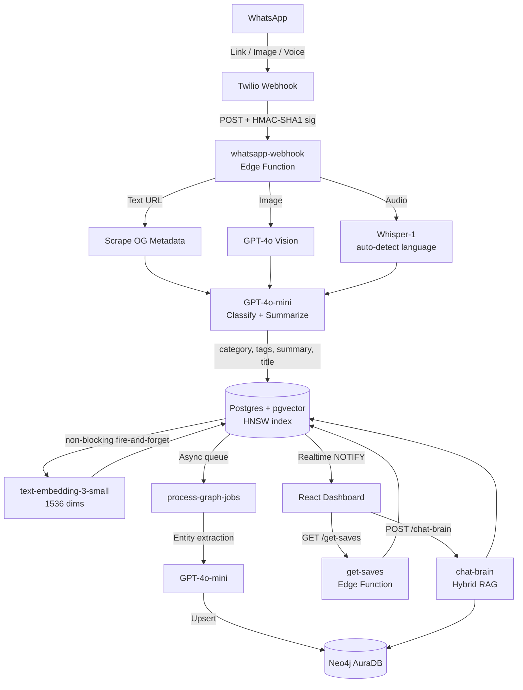
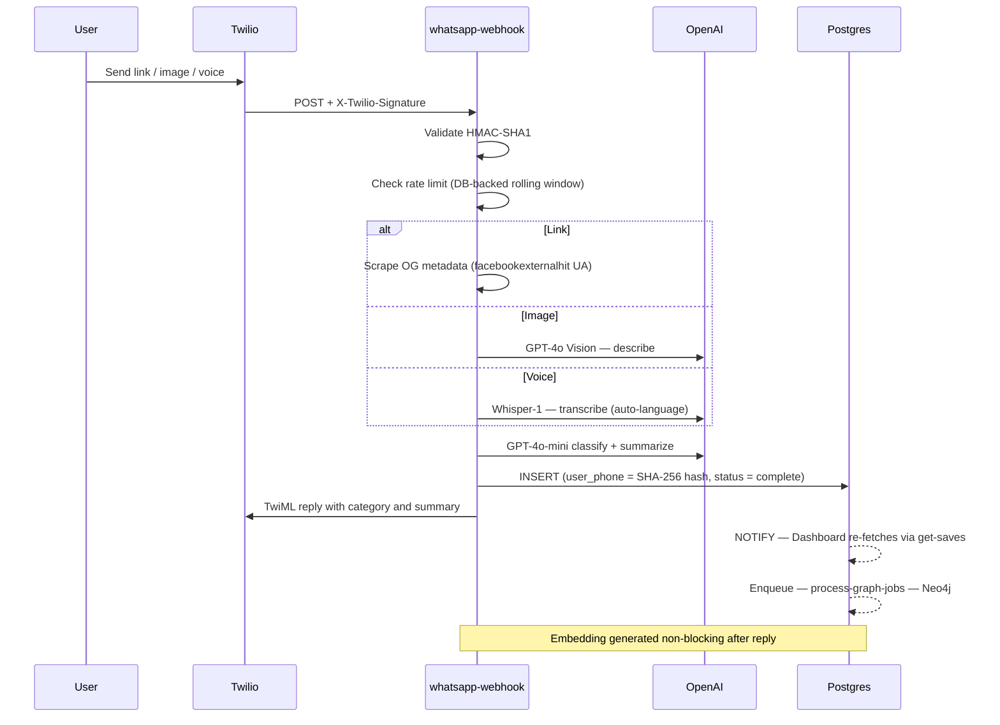

<div align="center">

# Social Saver

### Turn any WhatsApp message into an AI-powered, searchable knowledge graph.

[](https://vitejs.dev/)
[](https://supabase.com/)
[](https://openai.com/)
[](https://neo4j.com/)
[](https://github.com/pgvector/pgvector)
[](https://twilio.com/)
[](https://playwright.dev/)

*Send a link. AI classifies it. The graph stores it. You search, recap, and rediscover it.*

**[Open Live Demo](https://hack180dc.vercel.app)** &nbsp;|&nbsp; **[GitHub Repository](https://github.com/Aji-25/hack180dc)**

</div>

---

## Screenshots

**Dashboard — Content Library**


**AI Chat — Ask My Saves**


**Knowledge Graph — Neo4j Entity Map**


**Weekly AI Recap**


**Settings — Notion Sync and Spaced Repetition**


---

## Overview

Social Saver is a WhatsApp-first personal knowledge graph. You text a link to a Twilio bot. Within seconds, GPT-4o-mini classifies it, generates a summary and tags, creates HNSW-indexed vector embeddings, and extracts semantic entities — then surfaces everything through a hybrid Graph-RAG engine that connects concepts across your entire library.

**Zero-friction input.** No app to open. No extension to install. No folders, tags, or names to manage.  
**Compounding intelligence.** Every save enriches the graph, making every future retrieval more precise.

> Try the live demo at [hack180dc.vercel.app](https://hack180dc.vercel.app) — loads with mock data so you can explore all features instantly.

---

## Table of Contents

- [Screenshots](#screenshots)
- [Overview](#overview)
- [Feature Status](#feature-status)
- [Architecture](#architecture)
- [AI Pipeline](#ai-pipeline)
- [Security Model](#security-model)
- [Tech Stack](#tech-stack)
- [Quick Start](#quick-start)
- [Demo Script](#demo-script-60-seconds)

---

## Feature Status

### Shipped and Stable

| Feature | Tech | Notes |
|---|---|---|
| WhatsApp Inbox | Twilio | Any link replies with category and summary in ~3s |
| AI Classification | GPT-4o-mini | Auto category + 3–6 tags + 20-word summary, zero user input |
| Voice Note Transcription | Whisper-1 | Multilingual auto-detect, no hardcoded language |
| Image Understanding | GPT-4o-mini Vision | Describes images and classifies content |
| Server-Mediated DB Access | Supabase RLS + Edge Functions | Anon key blocked. All reads/writes via service-role-only edge functions |
| SHA-256 Phone Hashing | Deno `crypto.subtle` | Raw phone numbers never touch the database |
| Twilio Signature Validation | HMAC-SHA1 | Every webhook validated and rejected on mismatch |
| Timing-Safe Auth | XOR byte comparison | `DEMO_KEY` comparison is constant-time and timing-attack resistant |
| Fail-Closed Auth | env check | Missing `DEMO_KEY` returns 403. Never silently opens access |
| HNSW Vector Index | pgvector | O(log n) similarity search, no full table scans |
| Persistent Rate Limiting | Supabase Postgres | Per-phone quotas with rolling windows that survive Deno cold starts |
| Realtime UX | Supabase WebSockets | Realtime triggers cache invalidation; UI re-fetches via `get-saves` |
| Weekly AI Recap | GPT-4o-mini | Weekly digest covering themes, patterns, and suggestions |
| Notion Export | Notion API | Batch export of all saves with rate-limit handling |
| Dead-Letter Queue | Postgres | Failed Neo4j jobs retry 3x then land in `failed_graph_jobs` |
| E2E Tests | Playwright | Dashboard load and Graph-RAG chat flow, fully mocked |
| Soft Deletes | `is_deleted` flag | Saves are never hard-deleted from the database |

### Experimental (Working, Evolving)

| Feature | Tech | Notes |
|---|---|---|
| Hybrid Graph-RAG Chat | Neo4j + pgvector | Vector and multi-hop graph traversal in parallel; 50-entry LRU cache with cache hit indicator |
| Knowledge Graph UI | Neo4j AuraDB | Force-directed entity map with graceful fallback to local category graph |
| Predictive Analysis | GPT-4o-mini | Save a travel link and packing suggestions auto-fire non-blocking in the background |
| Deep Research Mode | GPT-4o-mini | One-click dossier with academic context, counter-arguments, and web consensus |
| Random Inspiration | get-saves edge fn | Offset-based random pick to rediscover forgotten saves |
| Spaced Repetition | WhatsApp + Supabase | Sends a WhatsApp reminder about saves from 3 days ago |

### Roadmap

| Feature | Notes |
|---|---|
| OTP Auth + per-user RLS | Upgrade from phone-hash isolation to native `auth.uid()` policies |
| Multi-channel gateway | Telegram and Signal beyond WhatsApp |
| Browser extension | Save without picking up your phone |

---

## Architecture



### Webhook Sequence



---

## AI Pipeline

### Hybrid Graph-RAG (`chat-brain`)

Every "Ask My Saves" query runs the following pipeline in parallel:

```
1. Entity + intent extraction  —  GPT-4o-mini
   e.g. "fitness workouts" → { intent: search, entities: ["fitness", "workouts"] }

2. Vector similarity search    —  text-embedding-3-small + pgvector HNSW (cosine >= 0.45)

3. Graph traversal             —  Neo4j multi-hop CO_OCCURS_WITH walk (up to 2 hops)

4. Merge + rank                —  "both" > "graph" > "vector"; graph-only results get x0.7 weight

5. Synthesize answer           —  GPT-4o-mini with top-10 saves as context

6. LRU cache                   —  50-item, 5-min TTL with a cache hit indicator on responses
```

Telemetry returned per query: entities extracted, graph nodes matched, hop count (1 or 2), retrieval source per citation.

### Knowledge Graph Schema (Neo4j)

```cypher
(:User)-[:SAVED]->(:Save)-[:IN_CATEGORY]->(:Category)
(:Save)-[:HAS_TAG]->(:Tag)
(:Save)-[:MENTIONS]->(:Entity)          // GPT extracts tools, concepts, people
(:Entity)-[:CO_OCCURS_WITH]->(:Entity)  // weighted by co-save frequency
(:Entity)-[:RELATED_TO {rel}]->(:Entity)
```

Entity types: `tool`, `concept`, `topic`, `exercise`, `food`, `brand`, `person`, `other`

---

## Security Model

| Layer | Implementation | Status |
|---|---|---|
| Phone PII | SHA-256 hash before every DB write; raw number never stored | Active |
| Twilio Webhook Auth | HMAC-SHA1 `X-Twilio-Signature` on every inbound request | Active |
| DB Access Control | RLS: `service_role` only. Anon key blocked for all operations | Active |
| Server-Mediated Reads | All UI reads go through `get-saves` edge fn; direct anon-key queries are impossible | Active |
| Tenant Isolation | `update-save` / `delete-save` verify `user_phone` hash ownership before mutating | Active |
| Soft Deletes | `is_deleted` flag — saves are never hard-deleted from DB | Active |
| Timing-Safe Key Compare | `DEMO_KEY` comparison uses XOR byte loop — timing-attack resistant | Active |
| Fail-Closed Auth | Missing `DEMO_KEY` returns 403. Requires explicit `DEMO_MODE=true` to open | Active |
| Twilio Error Scrubbing | Twilio errors logged server-side only; client receives generic 502 | Active |
| Env Var Guards | Missing `SUPABASE_URL` or `SUPABASE_SERVICE_ROLE_KEY` throws an explicit startup error | Active |
| URL Dedup Hashing | `url_hash` uses `encode(sha256(url::bytea), 'hex')` — no MD5 collisions | Active |
| Rate Limiting | Postgres `rate_limits` table with rolling windows and accurate resetAt timestamps | Active |
| Dead-Letter Resiliency | `failed_graph_jobs` table — failed Neo4j jobs are preserved, not dropped | Active |
| OTP Auth + User RLS | Supabase `auth.uid()` policies. Current demo uses `?u=<hash>` capability links. | Roadmap |

> [!CAUTION]
> **Never use `TWILIO_SKIP_VALIDATION=true` in production.** It disables webhook signature verification, allowing anyone to POST fake WhatsApp messages to your endpoint. This setting is for local development only.

---

## Tech Stack

### Backend — Supabase Edge Functions (Deno runtime)

| Component | Technology |
|---|---|
| LLM — classify, chat, research | OpenAI GPT-4o-mini |
| Vector embeddings | OpenAI text-embedding-3-small (1536 dims) |
| Vector search | pgvector HNSW index — cosine similarity |
| Vision (images) | OpenAI GPT-4o-mini Vision |
| Audio transcription | OpenAI Whisper-1 (auto language detection) |
| Knowledge graph | Neo4j AuraDB + Cypher |
| Messaging | Twilio WhatsApp Sandbox API |
| Auth guard | Timing-safe XOR + fail-closed DEMO_KEY |

### Frontend

| Component | Technology |
|---|---|
| Framework | React 18 + Vite |
| Styling | Vanilla CSS + CSS variables |
| Animation | Framer Motion |
| Graph visualization | react-force-graph-2d |
| Realtime (cache invalidation) | Supabase JS WebSocket subscriptions |
| Accessibility | Full ARIA dialog roles, `aria-pressed`, `aria-expanded`, Escape key on all modals |
| Automated tests | Playwright E2E (fully mocked, no credentials needed) |

---

## Quick Start

### Prerequisites

- Node.js 18+
- [Supabase](https://supabase.com/) project
- [Twilio](https://twilio.com/) account (WhatsApp Sandbox)
- OpenAI API key — [platform.openai.com](https://platform.openai.com/api-keys)
- (Optional) [Neo4j AuraDB](https://neo4j.com/cloud/platform/aura-graph-database/) free instance

### 1. Clone and Install

```bash
git clone https://github.com/Aji-25/hack180dc.git
cd hack180dc/social-saver
npm install
```

### 2. Frontend Environment

```bash
cp .env.example .env
```

Fill in your values:

```env
VITE_SUPABASE_URL=https://YOUR_PROJECT_REF.supabase.co
VITE_SUPABASE_ANON_KEY=eyJ...
VITE_EDGE_FUNCTION_URL=https://YOUR_PROJECT_REF.supabase.co/functions/v1

# Optional — enables live Knowledge Graph view
VITE_NEO4J_URI=neo4j+s://xxxx.databases.neo4j.io
VITE_NEO4J_USER=neo4j
VITE_NEO4J_PASSWORD=...
```

### 3. Link Supabase and Push Migrations

```bash
npx supabase link --project-ref YOUR_PROJECT_REF
npx supabase db push --include-all
```

This applies all migrations including:
- pgvector HNSW index on `saves.embedding`
- SHA-256 `url_hash`
- `graph_jobs` table with `updated_at` auto-trigger
- `match_saves` function with CTE and `SET search_path`

### 4. Set Supabase Secrets

```bash
npx supabase secrets set OPENAI_API_KEY=sk-proj-...
npx supabase secrets set SUPABASE_URL=https://YOUR_PROJECT_REF.supabase.co
npx supabase secrets set SUPABASE_SERVICE_ROLE_KEY=eyJ...
npx supabase secrets set TWILIO_ACCOUNT_SID=AC...
npx supabase secrets set TWILIO_AUTH_TOKEN=...
npx supabase secrets set FRONTEND_URL=https://your-app.vercel.app
npx supabase secrets set DEMO_KEY=your-32-char-random-secret

# Optional — Knowledge Graph
npx supabase secrets set NEO4J_URI=neo4j+s://...
npx supabase secrets set NEO4J_USER=neo4j
npx supabase secrets set NEO4J_PASSWORD=...
npx supabase secrets set NEO4J_DATABASE=your-instance-id
```

> [!CAUTION]
> **Local Development Only.** The following disables Twilio signature verification. Never set this in production.
> ```bash
> npx supabase secrets set TWILIO_SKIP_VALIDATION=true
> ```

### 5. Deploy Edge Functions

```bash
# Public webhook (Twilio) — JWT verification off
npx supabase functions deploy whatsapp-webhook --no-verify-jwt

# All other functions — JWT verification on (default)
npx supabase functions deploy get-saves update-save delete-save chat-brain \
  deep-research graph-query notion-export process-graph-jobs graph-upsert-save \
  random-save predictive-analysis regenerate-embeddings retry-classify \
  send-reminders weekly-recap
```

### 6. Configure Twilio Webhook

In the [Twilio Console](https://console.twilio.com/) — Messaging — WhatsApp Sandbox — "A Message Comes In":

```
https://YOUR_PROJECT_REF.supabase.co/functions/v1/whatsapp-webhook
```

### 7. Run Locally and Test

```bash
npm run dev

# E2E tests — no credentials required, fully mocked
npx playwright test tests/e2e.spec.ts --headed
```

---

## Demo Script (60 seconds)

| Time | Action | What to Say |
|---|---|---|
| 0–7s | Point at the dashboard | "Most bookmark apps require tagging, folders, naming. Social Saver requires nothing — just WhatsApp." |
| 7–20s | Send an Instagram link to the bot | "I texted a link. The edge function scrapes it, GPT-4o-mini classifies it — appears here in real time." |
| 20–30s | Point at the save card | "Category, tags, 20-word summary — zero input from me. Even protected Instagram reels get classified from URL structure alone." |
| 30–42s | Type in Ask My Saves | "This is Hybrid Graph-RAG. Vector similarity plus multi-hop Neo4j traversal — finds connections you would never tag manually." |
| 42–50s | Switch to Graph View | "Here we can visualize the underlying entity graph — Neo4j AuraDB, force-directed, live from your actual saves." |
| 50–60s | Click Weekly Recap | "One click generates your weekly AI digest — themes, patterns, and what to explore next." |

---

<div align="center">

Save smarter. Rediscover faster. Never lose a link again.

Built for **Hack180** &nbsp;|&nbsp; [hack180dc.vercel.app](https://hack180dc.vercel.app) &nbsp;|&nbsp; [github.com/Aji-25/hack180dc](https://github.com/Aji-25/hack180dc)

</div>
