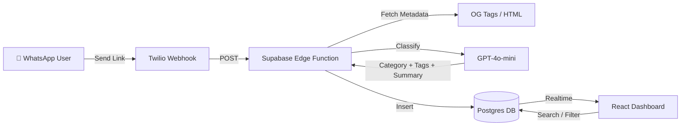
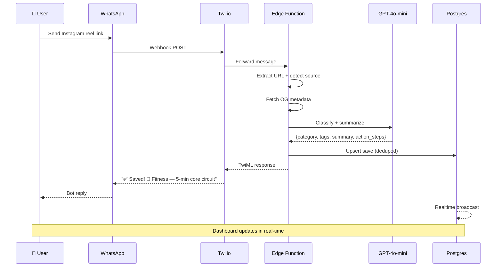

# 🔖 Social Saver Bot

<div align="center">

**Turn Instagram saves into a searchable, AI-powered knowledge base via WhatsApp.**

[](https://vitejs.dev/)
[](https://supabase.com/)
[](https://openai.com/)
[](https://twilio.com/)
[](https://supabase.com/)
[](LICENSE)

</div>

---

## 🚀 Overview

Social Saver is a full-stack AI-powered bookmark manager that lets users save, categorize, and rediscover social media content through WhatsApp. Send any link → the AI auto-categorizes it with tags, actionable summaries, and step-by-step instructions → browse your personal dashboard with natural language search, weekly recaps, and collections.

### 🌟 Key Features

- **📱 WhatsApp Integration** — Forward any link via WhatsApp, get an instant AI summary back
- **🎙️ Voice Notes** — Send voice memos; AI transcribes and organizes your thoughts (Whisper)
- **📸 Vision Support** — Snap a photo of a book/product; AI extracts details (GPT-4o Vision)
- **🧠 Chat with Brain** — "Draft a tweet from my fitness saves" — generate content from your library
- **🤖 AI Classification** — GPT-4o-mini categorizes into 8 categories with tags + actionable summaries
- **💬 Ask My Saves** — Natural language queries: "Show me all chicken recipes" → instant results
- **✨ Weekly AI Recap** — 5-bullet personalized summary of your week's saves
- **🎯 Action Steps** — Fitness/Food/Coding saves include 2-4 actionable steps
- **📂 Collections View** — Auto-group saves by category with collapsible sections
- **🧠 Vector Search (RAG)** — Semantic search that understands "how to get strong" matches "gym routine" (using OpenAI Embeddings)
- **🕸️ Knowledge Graph** — Visualise your second brain with an interactive force-directed graph
- **🕵️ Deep Research Agent** — AI generates a "Research Dossier" (counter-arguments, academic context) for any save
- **🔮 Predictive Context** — Anticipates your needs (e.g., Save flight → Suggests hotels) automatically
- **📝 Notion Sync** — One-click export of your curated saves to a Notion database
- **⏰ Spaced Repetition** — Automated WhatsApp reminders to review old saves ("Don't just save, read")
- **📊 Stats Dashboard** — Weekly save count, top category, engagement metrics
- **⚡ Realtime** — Saves appear on dashboard instantly via Supabase subscriptions

---

## 🏗️ Architecture



### Core Workflows



---

## 🛠️ Technology Stack

### 🔗 Backend & AI
- **Supabase Edge Functions** — Deno-based serverless functions
- **GPT-4o-mini** — JSON-mode classification with action step extraction
- **Twilio** — WhatsApp Sandbox integration
- **Postgres** — Full-text search + realtime subscriptions

### 🎨 Frontend
- **React 18 + Vite** — Lightning-fast development and builds
- **Tailwind CSS v4** — Utility-first styling with custom design system
- **Lucide React** — Beautiful icon library
- **Supabase JS** — Client SDK for queries + realtime

### 📊 AI Features
- **Smart Classification** — 8 categories with weighted confidence
- **Actionable Summaries** — "What it is — why it matters" format
- **Action Steps** — Exercise reps, recipe ingredients, code concepts
- **Weekly Recap** — LLM-generated 5-bullet personalized digest
- **Natural Language Search** — Category-aware query parsing

---

## 🚀 Quick Start

### Prerequisites

- Node.js 18+ and npm
- Supabase account
- Twilio account (for WhatsApp)
- OpenAI API key

### Installation

1. **Clone the repository**
   ```bash
   git clone https://github.com/YOUR_USERNAME/social-saver.git
   cd social-saver
   ```

2. **Install dependencies**
   ```bash
   npm install
   ```

3. **Environment Setup**
   ```bash
   cp .env.example .env
   ```
   
   Edit `.env`:
   ```env
   VITE_SUPABASE_URL=https://your-project.supabase.co
   VITE_SUPABASE_ANON_KEY=eyJ...
   VITE_DEMO_PHONE=whatsapp:+1234567890
   ```

4. **Database Setup**
   
   Run `supabase/schema.sql` in your Supabase SQL Editor.

5. **Deploy Edge Functions**
   ```bash
   supabase login
   supabase link --project-ref YOUR_PROJECT_REF
   
   # Set secrets
   supabase secrets set OPENAI_API_KEY=sk-...
   supabase secrets set SUPABASE_URL=https://xxx.supabase.co
   supabase secrets set SUPABASE_SERVICE_ROLE_KEY=eyJ...
   supabase secrets set APP_URL=https://your-app.vercel.app
   
   # Deploy all functions
   supabase functions deploy whatsapp-webhook --no-verify-jwt
   supabase functions deploy get-saves --no-verify-jwt
   supabase functions deploy random-save --no-verify-jwt
   supabase functions deploy weekly-recap --no-verify-jwt
   supabase functions deploy retry-classify --no-verify-jwt
   ```

6. **Twilio WhatsApp Sandbox**
   
   Set webhook URL in [Twilio Console](https://console.twilio.com/):
   ```
   https://YOUR_PROJECT.supabase.co/functions/v1/whatsapp-webhook
   ```

7. **Start Development Server**
   ```bash
   npm run dev
   # Open http://localhost:5173?u=whatsapp:+YOUR_PHONE
   ```

8. **Deploy to Vercel**
   ```bash
   vercel --prod
   ```

---

## 📋 Feature Deep Dive

### 💬 Ask My Saves

Natural language queries with smart intent parsing:

| Query | What Happens |
|-------|-------------|
| "Show me all workout videos" | Filters → Fitness category |
| "chicken recipes from Instagram" | Category: Food + Source: Instagram |
| "React hooks tips" | Category: Coding + text search |
| "my travel saves" | Filters → Travel category |

### 🎯 Action Steps

AI extracts 2-4 actionable bullets for Fitness, Food, and Coding categories:

| Category | Example Steps |
|----------|--------------|
| 💪 Fitness | "30s plank hold", "20 standing crunches", "15 bicycle kicks each side" |
| 🍳 Food | "Sauté garlic + sun-dried tomatoes", "Add pasta + broth", "Simmer 12 min" |
| 💻 Coding | "Use cleanup functions for subscriptions", "Memoize dependency arrays" |

### 📂 Collections View

Toggle between flat grid and grouped collections:
- Auto-groups by category with emoji labels
- Collapsible sections with counts
- Most-saved categories sorted first

### ✨ Weekly Recap

AI-generated 5-bullet summary:
1. Save count breakdown by category
2. Top themes across saves
3. Pattern recognition
4. Suggestions for next week
5. Motivational closing

---

## 📁 Project Structure

```
social-saver/
├── src/
│   ├── components/
│   │   ├── AskSaves.jsx          # Natural language save search
│   │   ├── CategoryChips.jsx     # Category filter chips with counts
│   │   ├── CollectionsView.jsx   # Category-grouped collapsible view
│   │   ├── EmptyState.jsx        # Empty state illustration
│   │   ├── Header.jsx            # Logo + weekly stats banner
│   │   ├── OnboardingOverlay.jsx # 3-step first-time tutorial
│   │   ├── QuickFilters.jsx      # Toggle: Instagram / Notes / Recent
│   │   ├── RandomInspiration.jsx # Random save rediscovery
│   │   ├── RecapModal.jsx        # AI weekly recap modal
│   │   ├── SaveCard.jsx          # Card with actions, notes, steps
│   │   ├── SearchBar.jsx         # Search with tag suggestions
│   │   └── Toast.jsx             # Toast notification system
│   ├── lib/
│   │   ├── constants.js          # Categories, emojis, labels
│   │   └── supabase.js           # Supabase client init
│   ├── App.jsx                   # Main app orchestrator
│   ├── index.css                 # Full design system + mobile CSS
│   └── main.jsx                  # Entry with ToastProvider
├── supabase/
│   ├── functions/
│   │   ├── whatsapp-webhook/     # Twilio → classify → save → reply
│   │   ├── get-saves/            # Query saves with filters
│   │   ├── random-save/          # Random save endpoint
│   │   ├── weekly-recap/         # AI weekly digest generator
│   │   └── retry-classify/       # Re-process failed saves
│   ├── schema.sql                # Full DB schema + FTS + RLS
│   └── seed.sql                  # Sample data for testing
├── .env.example                  # Environment template
├── .gitignore                    # Git ignore rules
└── README.md                     # This file
```

---

## 🔒 Environment Variables

| Variable | Where | Description |
|----------|-------|-------------|
| `VITE_SUPABASE_URL` | `.env` | Supabase project URL |
| `VITE_SUPABASE_ANON_KEY` | `.env` | Supabase anon (public) key |
| `VITE_DEMO_PHONE` | `.env` | Default phone for demo mode |
| `OPENAI_API_KEY` | Edge Function secret | OpenAI API key |
| `SUPABASE_URL` | Edge Function secret | Supabase project URL |
| `SUPABASE_SERVICE_ROLE_KEY` | Edge Function secret | Service role key |
| `APP_URL` | Edge Function secret | Deployed dashboard URL |

---

## 🎬 Demo Script (60 seconds)

| Time | Action |
|------|--------|
| 0-10s | Open WhatsApp → send Instagram Reel link to bot |
| 10-20s | Bot replies: "✅ Saved! 💪 Fitness — 5-min core circuit" + action steps |
| 20-30s | Open dashboard → card appears with category, summary, tags |
| 30-40s | Type "Show me all recipes" in Ask My Saves → instant filter |
| 40-50s | Switch to Collections view → grouped by category |
| 50-60s | Click "Weekly Recap" → AI generates personalized summary |

---

## ⚠️ Risk Mitigations

| Risk | Mitigation |
|------|------------|
| IG metadata fetch fails | LLM infers from URL structure; pending_note flow asks for user note |
| OpenAI latency >5s | GPT-4o-mini (fastest model); URL saved first before LLM call |
| LLM returns invalid JSON | JSON mode + try/catch + hardcoded fallback response |
| Duplicate links | `url_hash` unique index per user; upsert on conflict |
| No data for demo | Built-in mock data with 9 realistic saves for local dev |

> **Note**: Twilio signature validation is disabled for hackathon ease (`--no-verify-jwt`). In production, validate signatures and tighten RLS policies.

---

<div align="center">

**🔖 Save smarter. Rediscover faster. Never lose a link again.**

Built with ❤️ for Hack180

</div>
