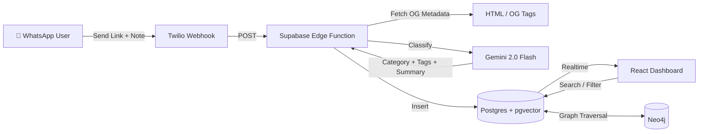
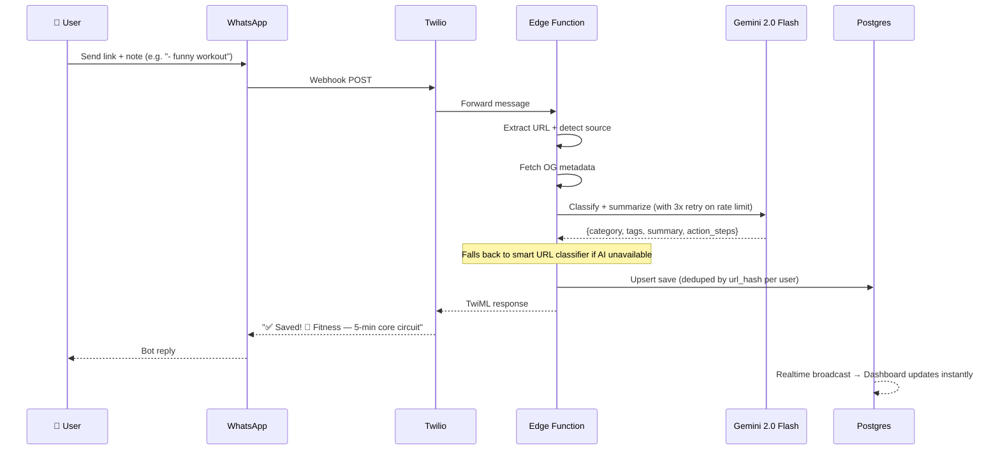

# 🔖 Social Saver Bot

<div align="center">

**Turn Instagram saves into a searchable, AI-powered knowledge base via WhatsApp.**

[](https://vitejs.dev/)
[](https://supabase.com/)
[](https://ai.google.dev/)
[](https://twilio.com/)
[](https://supabase.com/)
[](LICENSE)

</div>

---

## 🚀 Overview

Social Saver is a full-stack AI-powered bookmark manager that lets users save, categorize, and rediscover social media content through WhatsApp. Send any link → Gemini AI auto-categorizes it with tags, actionable summaries, and step-by-step instructions → browse your personal dashboard with natural language search, weekly recaps, and knowledge graph visualization.

### 🌟 Key Features

- **📱 WhatsApp Integration** — Forward any link via WhatsApp with an optional note; get an instant AI summary back
- **📸 Vision Support** — Snap a photo of a book/product; Gemini Vision extracts details automatically
- **🧠 Chat with Brain** — "Draft a tweet from my fitness saves" — generate content from your library using Graph-RAG
- **🤖 AI Classification** — Gemini 2.0 Flash categorizes into 8 categories with tags + actionable summaries
- **💬 Ask My Saves** — Natural language queries: "Show me all chicken recipes" → instant results via hybrid Vector + Graph search
- **✨ Weekly AI Recap** — 5-bullet personalized summary of your week's saves
- **🎯 Action Steps** — Fitness/Food/Coding saves include 2-4 actionable steps
- **📂 Collections View** — Auto-group saves by category with collapsible sections
- **🧠 Vector Search (RAG)** — Semantic search powered by Gemini Embeddings (`gemini-embedding-001`)
- **🕸️ Knowledge Graph** — Neo4j-backed graph links entities across saves for deeper retrieval
- **🕵️ Deep Research Agent** — AI generates a "Research Dossier" (counter-arguments, academic context) for any save
- **🔮 Predictive Context** — Anticipates your needs (e.g., Save flight → Suggests hotels) automatically
- **📝 Notion Sync** — One-click export of your curated saves to a Notion database
- **⏰ Spaced Repetition** — Automated WhatsApp reminders to review old saves
- **⚡ Realtime** — Saves appear on dashboard instantly via Supabase subscriptions
- **🔄 Smart Fallback** — Even when AI is rate-limited, saves get useful tags/summaries from URL structure and your note

---

## 🏗️ Architecture



### Core Workflow



---

## 🛠️ Technology Stack

### 🔗 Backend & AI
| Component | Technology |
|-----------|-----------|
| Serverless functions | Supabase Edge Functions (Deno) |
| AI classification & summarization | **Gemini 2.0 Flash** (`gemini-2.0-flash`) |
| Embeddings (vector search) | **Gemini Embeddings** (`gemini-embedding-001`) |
| Image understanding | **Gemini Vision** (multimodal) |
| Knowledge graph | **Neo4j** (Graph-RAG retrieval) |
| WhatsApp messaging | **Twilio** Sandbox |
| Database | **Postgres** + pgvector + Full-Text Search |

### 🎨 Frontend
| Component | Technology |
|-----------|-----------|
| Framework | React 18 + Vite |
| Styling | Tailwind CSS v4 |
| Icons | Lucide React |
| Realtime | Supabase JS client |

---

## 🚀 Quick Start

### Prerequisites

- Node.js 18+
- Supabase account + project
- Twilio account (WhatsApp Sandbox)
- **Google AI Studio** account → [Get a Gemini API key](https://aistudio.google.com/apikey)
- (Optional) Neo4j AuraDB instance for Graph-RAG

### Installation

1. **Clone the repository**
   ```bash
   git clone https://github.com/Aji-25/hack180dc.git
   cd hack180dc/social-saver
   ```

2. **Install dependencies**
   ```bash
   npm install
   ```

3. **Environment Setup**

   Create `social-saver/.env`:
   ```env
   VITE_SUPABASE_URL=https://your-project.supabase.co
   VITE_SUPABASE_ANON_KEY=eyJ...
   VITE_DEMO_PHONE=whatsapp:+1234567890
   ```

4. **Database Setup**

   Run `supabase/schema.sql` and `supabase/migrations/` in your Supabase SQL Editor.

5. **Deploy Edge Functions**
   ```bash
   npx supabase login
   npx supabase link --project-ref YOUR_PROJECT_REF

   # Set secrets (never commit these!)
   npx supabase secrets set GEMINI_API_KEY=AIza...
   npx supabase secrets set SUPABASE_URL=https://xxx.supabase.co
   npx supabase secrets set SUPABASE_SERVICE_ROLE_KEY=eyJ...
   npx supabase secrets set TWILIO_ACCOUNT_SID=AC...
   npx supabase secrets set TWILIO_AUTH_TOKEN=...
   npx supabase secrets set APP_URL=https://your-app.vercel.app

   # Optional (for Knowledge Graph)
   npx supabase secrets set NEO4J_URI=neo4j+s://...
   npx supabase secrets set NEO4J_USER=neo4j
   npx supabase secrets set NEO4J_PASSWORD=...

   # Deploy all functions
   npx supabase functions deploy whatsapp-webhook --no-verify-jwt
   npx supabase functions deploy get-saves --no-verify-jwt
   npx supabase functions deploy random-save --no-verify-jwt
   npx supabase functions deploy weekly-recap --no-verify-jwt
   npx supabase functions deploy retry-classify --no-verify-jwt
   npx supabase functions deploy chat-brain --no-verify-jwt
   npx supabase functions deploy deep-research --no-verify-jwt
   npx supabase functions deploy predictive-analysis --no-verify-jwt
   npx supabase functions deploy graph-query --no-verify-jwt
   npx supabase functions deploy graph-related-saves --no-verify-jwt
   npx supabase functions deploy graph-upsert-save --no-verify-jwt
   npx supabase functions deploy process-graph-jobs --no-verify-jwt
   npx supabase functions deploy send-reminders --no-verify-jwt
   ```

6. **Twilio WhatsApp Sandbox**

   Set the webhook URL in [Twilio Console](https://console.twilio.com/):
   ```
   https://YOUR_PROJECT.supabase.co/functions/v1/whatsapp-webhook
   ```

7. **Start Development Server**
   ```bash
   npm run dev
   # Open http://localhost:5173?u=whatsapp:+YOUR_PHONE
   ```

---

## 📋 Feature Deep Dive

### 💬 Ask My Saves (Hybrid RAG)

Queries use a hybrid retrieval pipeline combining vector similarity and Neo4j graph traversal:

| Query | What Happens |
|-------|-------------|
| "Show me all workout videos" | Vector search + Graph traversal → Fitness category filter |
| "chicken recipes from Instagram" | Category: Food + Source: Instagram + Semantic match |
| "React hooks tips" | Category: Coding + semantic text match |
| "what's related to my travel saves" | Graph traversal finds connected entities |

### 🎯 Action Steps

Gemini extracts 2-4 actionable bullets for Fitness, Food, and Coding categories:

| Category | Example Steps |
|----------|--------------| 
| 💪 Fitness | "30s plank hold", "20 standing crunches", "15 bicycle kicks each side" |
| 🍳 Food | "Sauté garlic + sun-dried tomatoes", "Add pasta + broth", "Simmer 12 min" |
| 💻 Coding | "Use cleanup functions in useEffect", "Memoize dependency arrays" |

### 🔄 Smart Fallback (Rate Limit Resilient)

When Gemini hits API rate limits (free tier: 15 req/min), the system:
1. Retries up to 3× with exponential backoff (1.5s, 3s, 4.5s)
2. Falls back to **URL-based classification** — detects reels vs posts, extracts username, and uses your note as the card description
3. Per-phone rate limiter (10 calls/min) prevents quota exhaustion

---

## 📁 Project Structure

```
social-saver/
├── src/
│   ├── components/
│   │   ├── AskSaves.jsx          # Graph-RAG chat interface
│   │   ├── CategoryChips.jsx     # Category filter chips with counts
│   │   ├── CollectionsView.jsx   # Category-grouped collapsible view
│   │   ├── EmptyState.jsx        # Empty state illustration
│   │   ├── Header.jsx            # Logo + weekly stats banner
│   │   ├── OnboardingOverlay.jsx # 3-step first-time tutorial
│   │   ├── QuickFilters.jsx      # Toggle: Instagram / Notes / Recent
│   │   ├── RandomInspiration.jsx # Random save rediscovery
│   │   ├── RecapModal.jsx        # AI weekly recap modal
│   │   ├── SaveCard.jsx          # Card with actions, notes, steps
│   │   ├── SearchBar.jsx         # Search with tag suggestions
│   │   ├── SyncModal.jsx         # Settings + Notion sync
│   │   └── Toast.jsx             # Toast notification system
│   ├── lib/
│   │   ├── constants.js          # Categories, emojis, labels
│   │   └── supabase.js           # Supabase client init
│   ├── App.jsx                   # Main app orchestrator
│   ├── index.css                 # Full design system + mobile CSS
│   └── main.jsx                  # Entry with ToastProvider
├── supabase/
│   ├── functions/
│   │   ├── chat-brain/           # Hybrid Vector + Graph-RAG conversation
│   │   ├── deep-research/        # AI research dossier generation 
│   │   ├── get-saves/            # Fetch user saves
│   │   ├── graph-query/          # Query Neo4j graph for saves
│   │   ├── graph-related-saves/  # Get visually related entities
│   │   ├── graph-upsert-save/    # Process saves into Neo4j graph
│   │   ├── predictive-analysis/  # Anticipate next user actions
│   │   ├── process-graph-jobs/   # Async Neo4j graph processing 
│   │   ├── random-save/          # Pick random link
│   │   ├── retry-classify/       # Re-process failed saves
│   │   ├── send-reminders/       # Spaced repetition reminders
│   │   ├── weekly-recap/         # AI-generated digest
│   │   └── whatsapp-webhook/     # Twilio → classify → save → reply
│   ├── migrations/               # Database migrations (including graph jobs)
│   ├── schema.sql                # Full DB schema + FTS + RLS + Triggers
│   └── seed.sql                  # Sample data for testing
├── .env.example                  # Environment template
├── .env.backend.example          # Environment template for backend / edge functions
├── .gitignore                    # Git ignore rules
└── README.md                     # This file
```

---

## 🔒 Environment Variables

### Frontend (`.env`)
| Variable | Description |
|----------|-------------|
| `VITE_SUPABASE_URL` | Supabase project URL |
| `VITE_SUPABASE_ANON_KEY` | Supabase anon (public) key |
| `VITE_DEMO_PHONE` | Default phone for demo mode |

### Edge Function Secrets (`supabase secrets set`)
| Variable | Description |
|----------|-------------|
| `GEMINI_API_KEY` | Google AI Studio API key |
| `SUPABASE_URL` | Supabase project URL |
| `SUPABASE_SERVICE_ROLE_KEY` | Service role key (admin access) |
| `TWILIO_ACCOUNT_SID` | Twilio account SID |
| `TWILIO_AUTH_TOKEN` | Twilio auth token |
| `APP_URL` | Deployed dashboard URL |
| `NEO4J_URI` | Neo4j AuraDB URI |
| `NEO4J_USER` | Neo4j absolute username (`neo4j`) |
| `NEO4J_PASSWORD` | Neo4j password |

---

## 🎬 Demo Script (60 seconds)

| Time | Action |
|------|--------|
| 0–10s | WhatsApp → send any Instagram link + note (e.g. "funny reel") |
| 10–20s | Bot replies: "✅ Saved! 📌 Other — funny reel — reel saved from instagram." |
| 20–30s | Dashboard updates in realtime → card appears with tags |
| 30–40s | Type "Show me all recipes" in Ask My Saves → instant results |
| 40–50s | Switch to Collections view → saves grouped by category |
| 50–60s | Click "Weekly Recap" → Gemini generates personalized summary |

---

## ⚠️ Known Limitations & Mitigations

| Issue | Mitigation |
|-------|------------|
| Instagram blocks OG metadata scraping | Smart fallback uses URL structure + user note for description |
| Gemini free tier: 15 req/min | Per-phone rate limiter + 3× retry with backoff; enable billing for 1500 req/min |
| Voice notes not supported | Gemini REST API doesn't expose audio transcription directly |
| Twilio JWT disabled | `--no-verify-jwt` used for hackathon ease; add signature validation in production |

---

<div align="center">

**🔖 Save smarter. Rediscover faster. Never lose a link again.**

Built with ❤️ for Hack180

</div>
